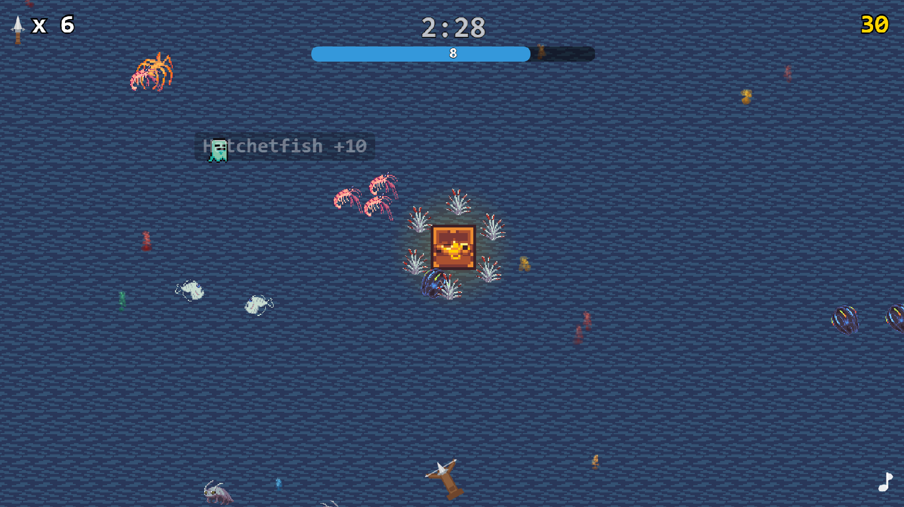
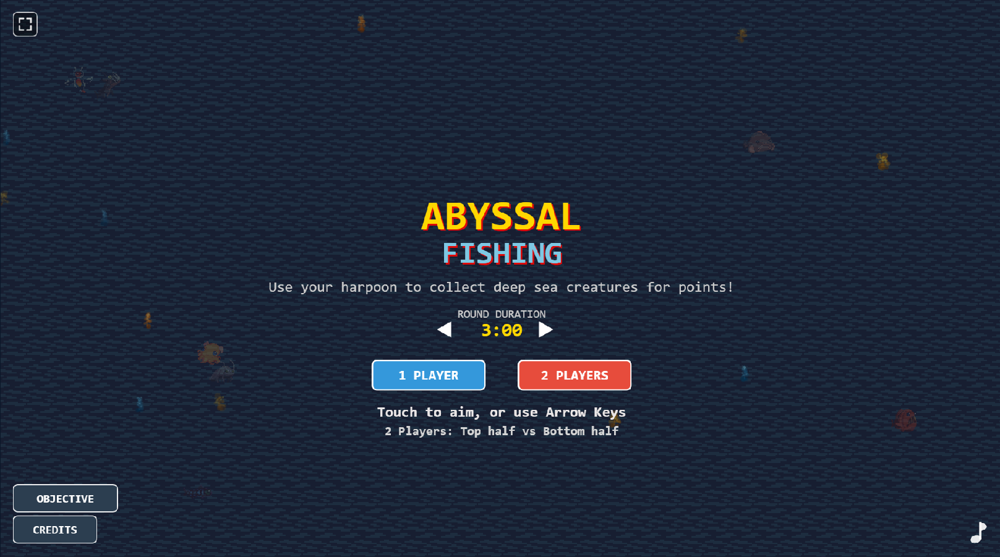
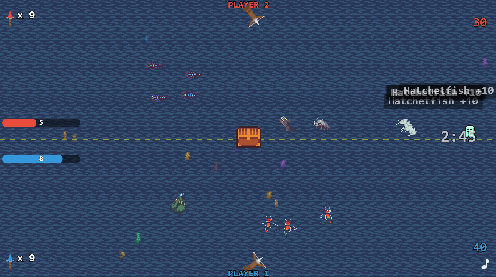
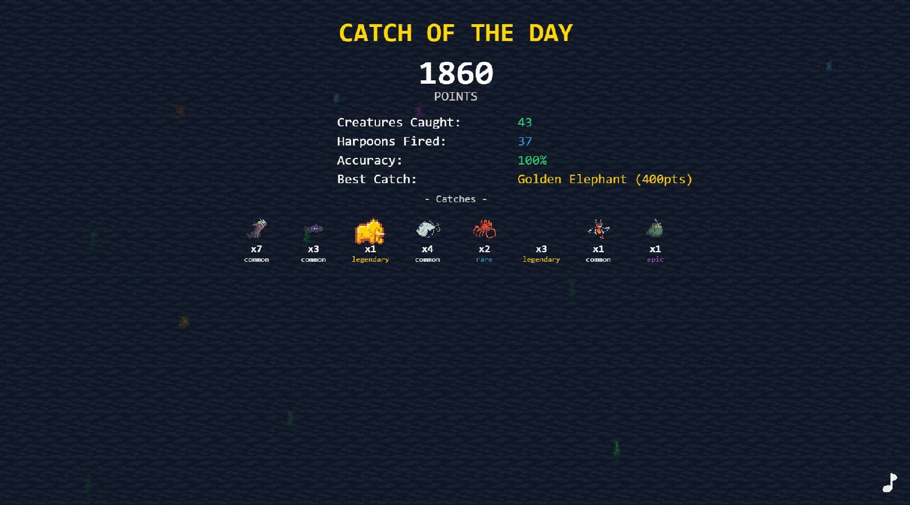

# Harpoon Fishing

A top-down arcade fishing game where you aim and fire harpoons to catch deep-sea creatures. Compete solo or head-to-head in split-screen two-player mode.

Built with vanilla JavaScript and the Canvas 2D API — no frameworks, no dependencies.



## How to Play

Drag to aim your harpoon, release to fire. Catch creatures to earn points and bonus harpoons. When you're out of harpoons or the round timer hits zero, the game is over.

### Controls

| Action      | Input                          |
|-------------|--------------------------------|
| Aim         | Click/touch and drag           |
| Fire        | Release                        |
| Player zone | Bottom half (P1), Top half (P2)|

## Features

### Game Modes

- **Single Player** — catch as many creatures as you can before running out of harpoons
- **Two Player** — split-screen competitive mode with a shared play field
- **Configurable Rounds** — set round length from 1 to 10 minutes



### 22 Deep-Sea Creatures

Creatures are grouped by rarity, with higher tiers moving faster and scoring more points.

| Rarity    | Count | Base Speed | Point Range | Examples                             |
|-----------|-------|------------|-------------|--------------------------------------|
| Common    | 8     | 100        | 10-30       | Giant Isopod, Sea Spider, Tubeworm   |
| Uncommon  | 4     | 150        | 30          | Cookie Cutter Shark, Vampire Squid   |
| Rare      | 5     | 200        | 50          | Blobfish, Frilled Shark, Spider Crab |
| Epic      | 2     | 250        | 75          | Anglerfish, Goblin Shark             |
| Legendary | 2     | 300        | 100         | Barrelfish, Gulper Eel               |

Special spawn:

- **Ghost** (not part of the 22 standard species): 0 points, +7 harpoons, spawns every 30 seconds (or 15 seconds in active two-player flow).

### Dynamic Difficulty

Difficulty is based on remaining harpoons and affects rarity odds, movement speed, and spawn cadence:

| Tier  | Harpoons | Rarity Weights (Common/Uncommon/Rare/Epic/Legendary) | Speed Multiplier | Spawn Interval |
|-------|----------|------------------------------------------------------|------------------|----------------|
| Early | 7+       | 69 / 20 / 5 / 5 / 1                                  | 1.0x             | 1.5-3.0s       |
| Mid   | 4-6      | 39 / 30 / 20 / 10 / 1                                | 1.3x             | 1.0-2.5s       |
| Late  | 0-3      | 20 / 15 / 30 / 20 / 10                               | 1.6x             | 0.8-2.0s       |

Additional spawn behavior:

- 30% chance to spawn a school instead of a single creature.
- Schools are common creatures only and contain 3-6 fish.

### Treasure Chest

A chest at fixed center position (`x: 960`, `y: 525`) cycles through open/close states:

- Opens after a random 15-30 second closed interval.
- Stays open for a random 3-5 seconds.
- Uses short transitions (0.5s open/close, ~1s retreat).

When opened, it spawns one random treasure from 17 items:

- Value range: 150-450 points.
- Bonus harpoons: +2 to +3.
- Treasure is treated as legendary rarity.

By default, each treasure is surrounded by a rotating ring of 6 tubeworms for extra risk/reward catches.

### Two-Player Competitive



Players fire from opposite ends of the screen into a shared ocean. When your shot timer expires, you can buy back 5 harpoons for 500 points — a risk/reward tradeoff that keeps matches close.

### Score Screen

Track your total score, accuracy percentage, best single catch, and a gallery of every creature you caught during the round.



## Getting Started

**Prerequisites:** Node.js 18+

```bash
# Install dependencies
npm install

# Start the dev server (opens http://localhost:3000)
npm run dev

# Production build
npm run build

# Preview the production build
npm run preview
```

## Deployment

The game auto-deploys to GitHub Pages on push to `main` via the included workflow at `.github/workflows/deploy.yml`.

## Project Structure

```dir
js/
├── main.js                  # Entry point, canvas setup, responsive scaling
├── game.js                  # Fixed-timestep game loop (60 FPS)
├── data/                    # Creature definitions, config, spawn patterns
├── entities/                # Harpoon, SeaCreature, TreasureChest
├── rendering/               # SpriteSheet, Animator, UI, water background
├── states/                  # Start screen, gameplay, score screen
├── systems/                 # Input, collision, scoring, spawning, particles
└── utils/                   # Audio synthesis, math helpers
assets/                      # Sprite sheets and textures
css/                         # Minimal dark-theme styling
```

## Tech Stack

- **Rendering** — Canvas 2D API
- **Audio** — Procedurally generated via Web Audio API (no audio files)
- **Build** — Vite
- **Language** — Vanilla ES modules, no frameworks
